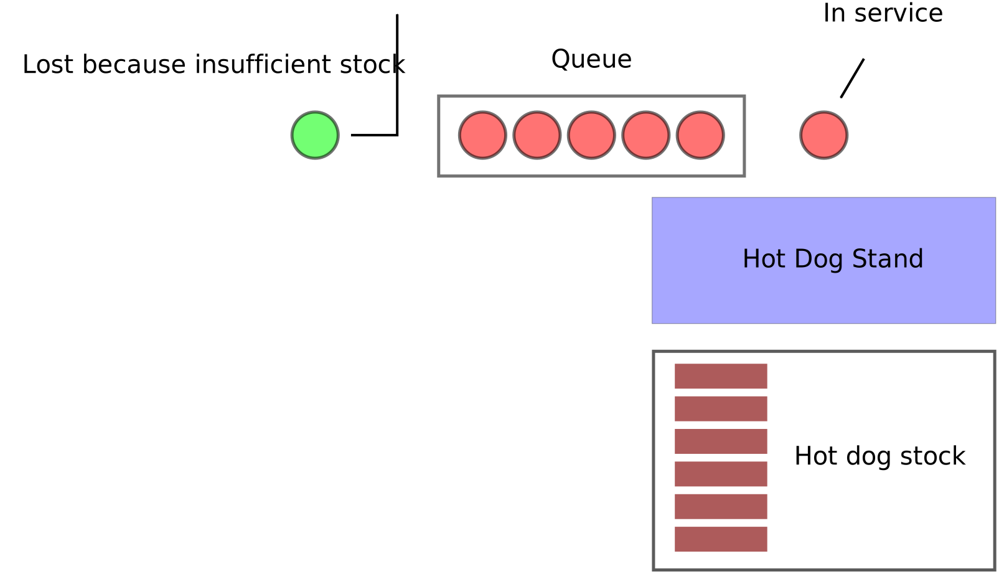

##Company:

Hot Dog Stand

##Required product:

Program to evaluate best quantity of hotdogs with which to restock a stand in stochastic conditions (and how often these should be restocked).

##Parameters:

The input to the problem is 4 parameters:

- Arrival rate (how often customers arrive wanting to buy a hotdog, assumed to follow an exponential distribution)
- Service rate (how quickly the single server can make a hotdog, assumed to follow an exponential distribution)
- The wholesale price of a hotdog (assumed constant)
- The retail price of a hotdog (assumed constant)

There are 2 decision parameters:

- The replenishment period (how often the hotdog stands orders hotdogs, assumed constant)
- The replenishment quantity (how many hotdogs the hotdog stand orders, assumed constant)

##Particularities that need to be taken in to account:

- Customers will be lost if they arrive at the queue and there are not sufficient hotdogs to feed them.
    **Note that they do not join the queue if there is not sufficient stock at the time of their arrival.**

As well as building a model of the system (consider that to be step one), if you can, obtain the best possible replenishment period and quantity for the following input parameters:

**Scenario 1**

- Arrival rate: 1 per time unit.
- Service rate: 2 per time unit.
- Wholesale price: 3.
- Retail price: 4.

**Scenario 2**

- Arrival rate: 1 per time unit.
- Service rate: 2 per time unit.
- Wholesale price: 1.
- Retail price: 8.

**Scenario 3**

- Arrival rate: 1 per time unit.
- Service rate: .9 per time unit.
- Wholesale price: 3.
- Retail price: 4.

**Scenario 3**

- Arrival rate: 1 per time unit.
- Service rate: .9 per time unit.
- Wholesale price: 3.
- Retail price: 40.

##Summary:

The following picture summarises your challenge:

##Evaluation:

Your code will be evaluated in terms of:

- Precision (does it work and if so is it correct? - This is an objective criteria)
- Performance (how fast is it? how does it handle bugs? - This is an objective criteria)
- Time taken to submit solution (This is an objective criteria)
- Clarity (is it well written/documented/tested  - This is a subjective criteria)

##Suggestion:

I suggest you proceed by clearly defining independent programming tasks and attempting to work independently whilst ensuring that each piece of code produced is capable of talking to each other piece.
