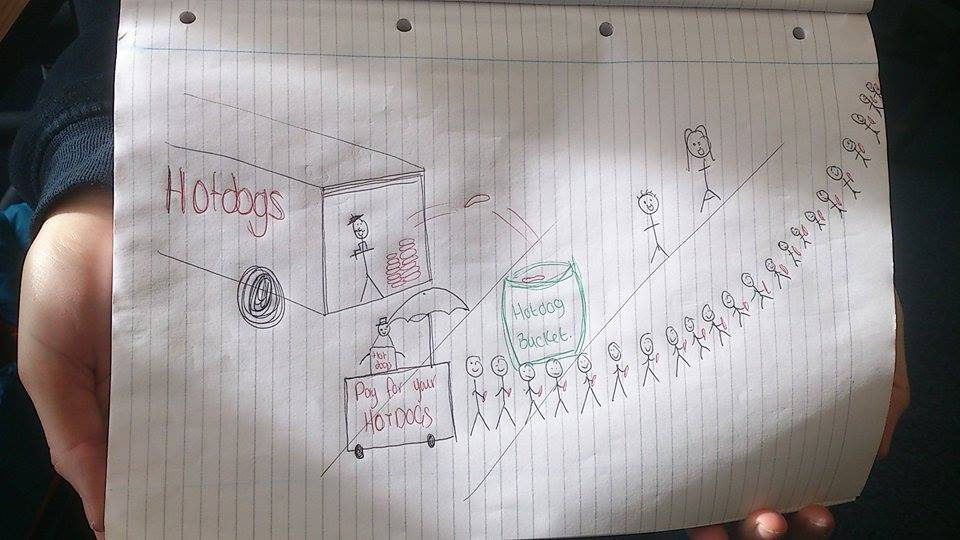

Past challenge:

- [Rock Paper Scissors](./RPS) [Solution.py](./RPS/Solution.py)
  ([Tests](./RPS/test_solution.py): don't worry about this too much,
  only if you're interested)
- [Supermarket Challenge](./SupermarketChallenge): [Solution.py](./SupermarketChallenge/Solution.py)
- [Hot Dog Stand](./HotDogStand): [Solution.py](./HotDogStand/Solution.py) ([Very short but still readable solution](./HotDogStand/ShortSolution/solution.py))

    Here's a funny/good picture one of the groups drew for this challenge when I told them to map the process they were trying to model (this actually nails it):

    
